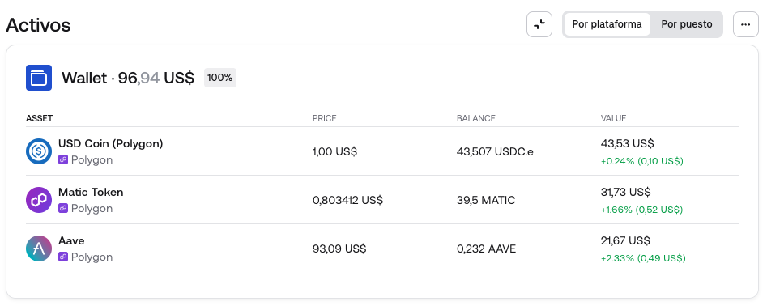

## Prueba técnica web3 (Español 🇪🇸)

- Hacer un frontend utilizando la ultima versión de Nextjs y Tailwind.
- El usuario que entra al sitio debe ser capaz de conectar su wallet utilizando wallet connect.
- Escoger una chain para trabajar: 
    - En caso de trabajar en Polygon se trabajara con el token ZURF ($ZRF).
    - En caso de trabajar en BNB chain se trabajara con el token KLT ($KLT).
- Una vez conectada su address, se debe cargar el balance del token. Es posible hacer esto de 2 formas:
    - Usando un hook  de wallet connect, donde se le pasa el address del token.
    - Interactuando directamente con el contrato del token, ingresando en la función balanceOf el address del usuario conectado. (Recomendado, pero más difícil).
- Conectarse con la API de Coingecko para obtener la relación del token con el USDT y mostrar el balance del usuario en dolares.
- La prueba técnica debe estar montada en vercel.
- Se considerara la prueba entregada cuando se le envie al revisor un sitio mondado en vercel.

### Puntos extras
- Un buen diseño sera considerado. (Ejemplo a continuación)

  

- Montar un servicio de CD, que automaticamente deploye el sitio cada vez que se haga un commit en la rama main.
- Terminar antes de la fecha límite.

### Adjuntos
- https://nextjs.org/
- https://tailwindcss.com/
- https://docs.walletconnect.com/
- https://viem.sh/
- https://www.coingecko.com/en/api
- https://vercel.com/

## Contratos
- KLT: https://bscscan.com/token/0xf87940f78f2f4d99a0c5c22e3fcc21795cd53245

- ZRF: 
https://polygonscan.com/address/0x232804231de32551f13a57aa3984900428adf990

### Adjunto puntos extra
- https://app.zerion.io/0x8df4c5b275790a5d77b397783b9747c1d678f177/overview
- https://vercel.com/guides/how-can-i-use-github-actions-with-vercel